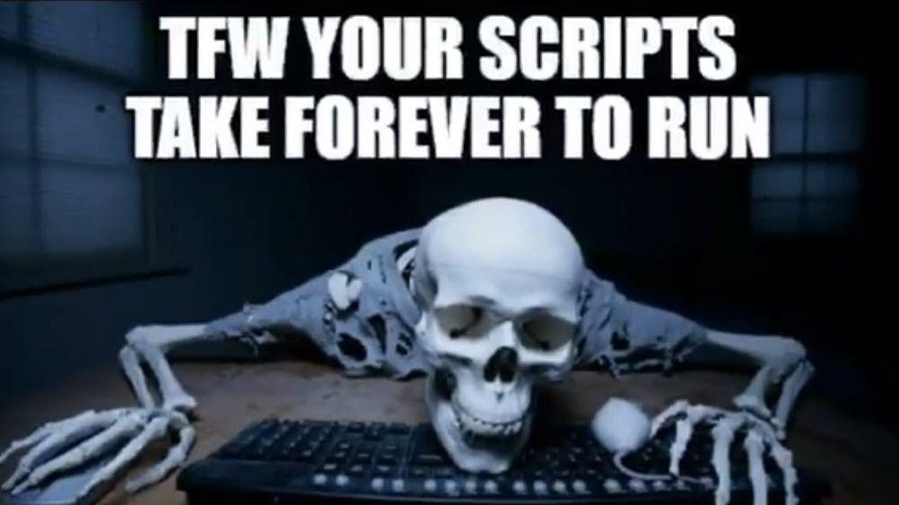

Mathias Jessen ([@IISResetMe](https://twitter.com/IISResetMe)) is giving us a demo and walkthrough on how we can profile our script's runtime performance using his latest tool [PSProfiler](https://github.com/IISResetMe/PSProfiler).

We can expect:
- A history of Measure-Script
- Usage demos
- A shallow dive into how and why it works the way it does

The session will be streamed live to our [YouTube channel](https://youtube.com/c/PowerShellSouthampton) and the recording will be made available for you to watch afterwards.

### Schedule

**17:15 - 17:30**: Setup & connectivity check  
**17:30 - 18:30**: Session  
**18:30 - 18:45**: Close up